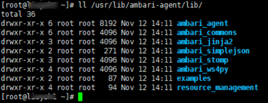
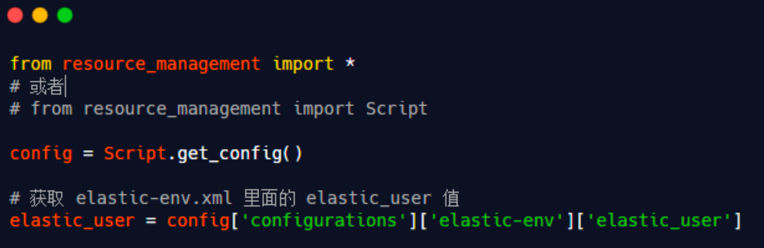

# Apache Ambari plugin for Apache DolphinScheduler

## Service commissioning tips
A very important command to restart the ambira service：ambari-server restart
ambari plugin configuration path：/var/lib/ambari-server/resources/common-services/DOLPHIN/2.0.6
ambari cache path：/var/lib/ambari-agent/cache/common-services/

## Related Knowledge

### Ambari python the use of dependency packages is explained in detail.

1、Dependency Package Description
This module is located in /usr/lib/ambari- server/lib/resource_management and is also available in the /usr/lib/ambari-agent/lib entry.
There is also a resource_management entry in the /usr/lib/ambari-agent/lib entry, which is the same as the resource_management entry in the /usr/lib/ambari-agent/lib entry.
These two entries are the same, and ambari's custom service application environment relies on this entry.

2、How do I get the configuration information on the custom service page?
When we open the configuration page of a custom service on the Ambari web page, we see that the configuration displayed above is the same as the contents of the xml file under configuration.
After a custom service is deployed, the contents of the xml file will be displayed on the front-end for users to view and modify, and the modified configuration information will be saved to the database.
How do we get the value of a particular configuration on the page? This is where we need to rely on the resource_management python package, which encapsulates a number of methods that we can directly invoke.
For example, to get the value of the elastic_user property in elastic-env.xml, we just need to do this

3、Ambari cluster-related configuration information is also available at
With Script.get_config(), we can also get some configuration information about the Ambari cluster, such as java version, hostname, etc.

4、A more friendly way to get property values than Script.get_config()
In the dependency package resource_management, there is a better function, default(), to get property values in a more friendly way.
If you have been using Script.get_config() for a long time, you may find that the Ambari custom service will report an error if the property obtained by Script.get_config() does not exist, and you will not be able to close the operation.
However, the defult() method is much better, and the two methods are described below.
from resource_management.libraries.functions.default import default

Above, we know how to get the value of the attribute in the xml file in two ways: Script.get_config() and default().

5、It would be great if the entire custom service could be written entirely in python, but there are some scenarios where shell statements are more convenient, so the dependency package resource_management also supports the ability to execute shell statements in python, as shown below.
from resource_management.core.resources.system import Execute

The Execute() method also specifies whether the execution user and failure are to be ignored, as shown in the following figure.

6、Create/delete folders, files within py script
6.1 Creating Folders, Files

6.2 Delete Folders, Files

